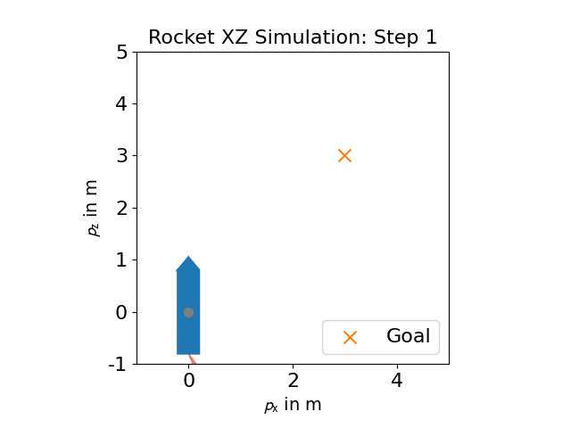
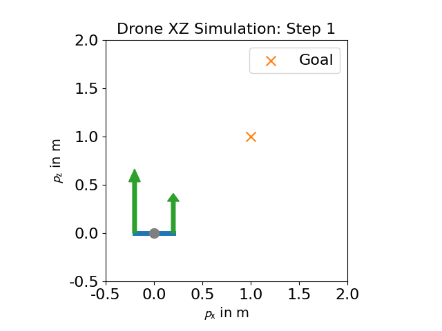
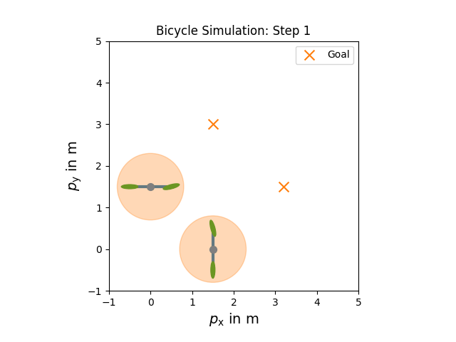
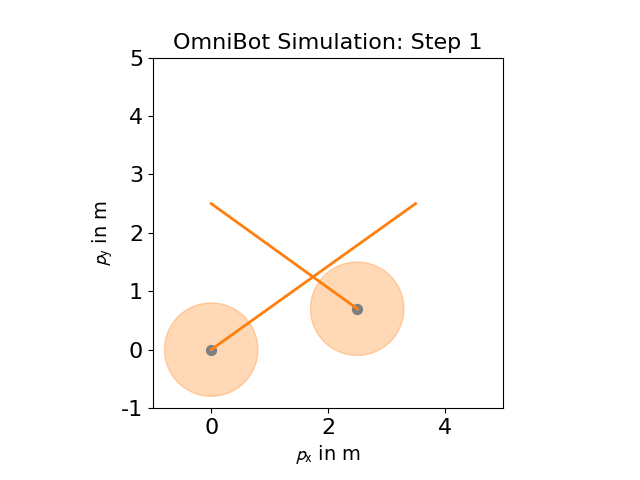

This repository is used as part of the lecture on Numerical Optimal Control by Prof. Moritz Diehl.

https://www.syscop.de/teaching/ws2025/numerical-optimal-control

The repository has been created based on https://github.com/JakobHarz/ControlHackathon by Jakob Harzer and Yunfan Gao.


### Examples

For inspiration, we prepared a few models and methods that you can use as a starting point. 

Ideas for Models:
- [2D-XY Bicycle](documentation/Model%20-%202D-XY%20Bicycle%20Control.md)
- [2D-XZ Drone](documentation/Model%20-%202D-XZ%20Drone%20Control.md)
- [2D-XZ Rocket](documentation/Model%20-%202D-XZ%20Rocket%20Control.md)

Ideas for Methods:
- Open Loop
	- [Open Loop Planning](documentation/Method%20-%20Open%20Loop%20Planning.md)
- Closed Loop
	- [Model Predictive Control](documentation/Method%20-%20Model%20Predictive%20Control.md)
	
For each of the models, we prepared examples that you can use as a starting point.










### Tools & Installation

We use the python framework [`CasAdi`](https://web.casadi.org/) to formulate OCPs.
If you already have Python installed on your system or want to use another IDE, feel free to skip to bullet 4.

```bash
pip install numpy scipy matplotlib casadi
```

In order to export the animations as gifs, you may also need to
```bash
pip install pillow
```

### Getting Started

First, please follow the installation instructions above.

1. If you have git installed, clone this repository using `git clone` into a folder of your choice.
Alternatively, you can simply download as a ZIP folder via the `<> Code` -Button somewhere in the top right (see screenshot).


2. Navigate to the cloned folder in your terminal
3. Run the example file
	```bash
	python examples/rocketXZSimpleOCP.py
	```
	If you see a figure popping up, that means that everything works as intended.

### Acknowledgements

We would like to thank Leander Bürkin for pointing out a bug in the drone dynamics.
